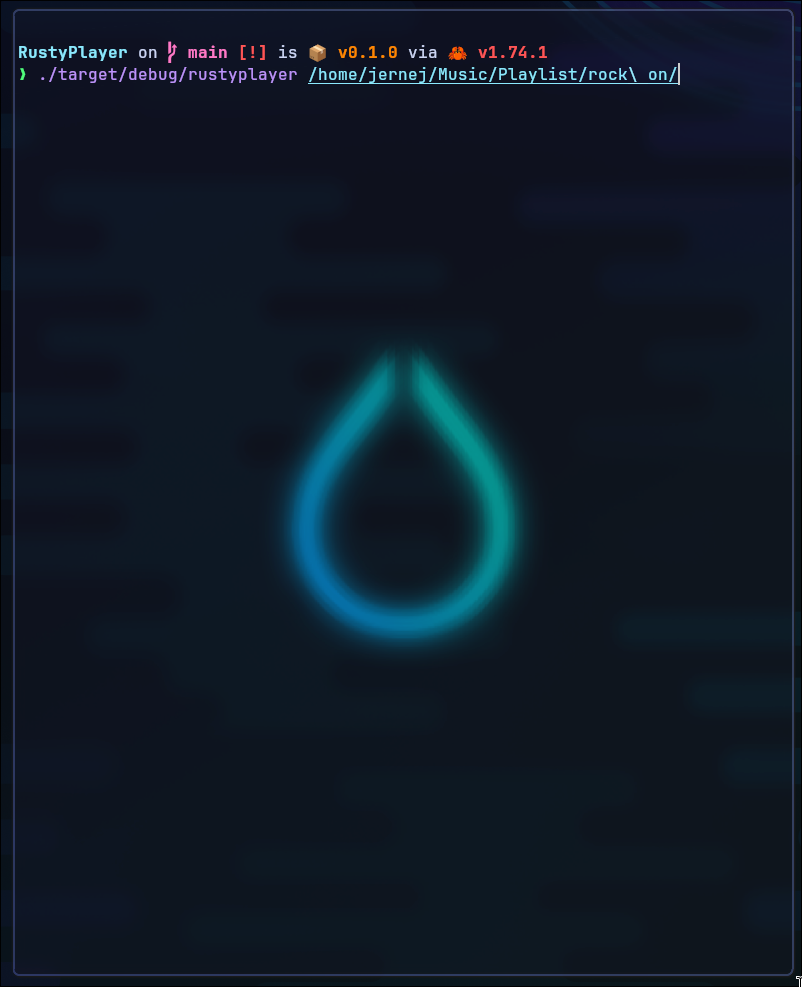
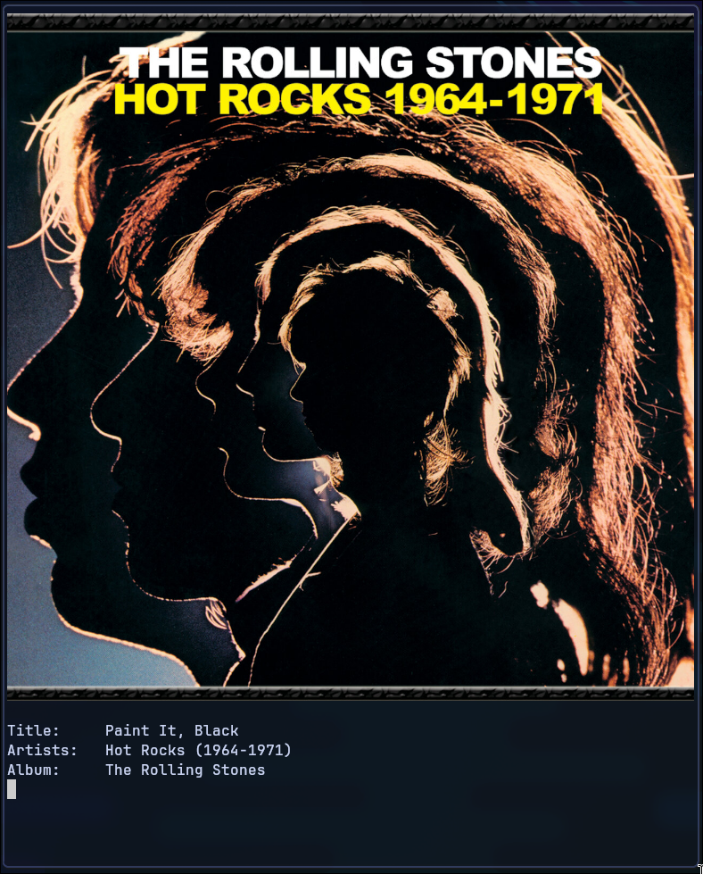

# Rustyplayer

Rustyplayer is a basic, somewhat functioning music listener written in Rust. It is my first serious Rust project and my most usefull coding project in general.

## Known issues:
if you have any more issue please report them
 - Song metadata not updating

## Installation

### Debian-based Distributions (Ubuntu, Debian, etc.)

```bash
sudo apt-get update
sudo apt-get install chafa metaflac
```

### RedHat/Fedora

```bash
sudo dnf install chafa metaflac
```

### Arch-based Distributions (Arch Linux, Manjaro, etc.)

```bash
sudo pacman -S chafa metaflac
```

### General Installation Steps

After installing the dependencies:

```bash
git clone https://github.com/jernejmarcic/RustyPlayer.git
cd RustyPlayer
cargo build --release
```

## Usage

Run Rustyplayer with the path to your music directory:

```bash
./target/release/rustyplayer /path/to/your/music/directory
```

Use the path argument only when you want to change the music directory. Rustyplayer remembers your last-used directory and automatically plays from it on subsequent launches.

### Screenshots

Entering the path to the music folder:

<br>

Rustyplayer showing the album cover, and information abot the playing song:

<br>


## Features

- Music playback with controls: `play`, `pause`, `next`, `toggle`, `previous` (Rodio, the audio backnd I use does not have seek functionality yet)
- Terminal-based album art display using `chafa`.
- Basic MPRIS support for desktop environment integration.
  - Supports inlcudes: 
    - Song title
    - Album
    - Song artists
    - Track lenght
    - Art url (kinda)
- Repeat and loop functionality.
- Configuration stored in base folder (whatever folder the binary is in), with future plans to adhere to XDG Base Directory specifications for Linux, and whatever Windows and Mac use.

## TODO

- [x] **Previous Track Logic**: Even though the foundation exists, implementing logic to play the previous track has been VERY F****** HARD. This involves managing song indexes and ensuring seamless playback transition.
- [ ] **Cross-Platform Support**: Extend compatibility to Windows and Mac. Some features might already work, but comprehensive testing and development are needed to ensure full functionality across different operating systems.
- [ ] **Art URL Improvement**: Currently, the album art URL is static. The goal is to dynamically generate this URL, ensuring it accurately reflects the currently playing track's album art across all platforms.
- [ ] **Config Enhancements**: Plans are in place to refine the configuration process, particularly by adhering to the XDG Base Directory specifications on Linux. Similar standards will be considered for Windows and Mac to streamline user settings and data management but IDK if Windows even has any standards for configration files.
- [ ] **Additional Features and Fixes**: Continuous effort to enhance the user interface, integrate more robust MPRIS support, and overall improve the codebase for better performance and user experience.

## Limitations

- Initial project with room for codebase improvements.
- Limited UI features.
- Dependency on Linux-specific tools for some features.
- In development MPRIS support
- Used WAYYYY too much ChatGPT

## Technical Details

Rustyplayer uses `rodio` for audio playback, `audiotags` for metadata handling, and `walkdir` for directory traversal.
In addition, is uses `metflac` for cover image and `chafa` to display that image in terminal.

## Contributing

Contributions are welcome, however brace yourself for the shitstorm that is my code. If you have ideas for improvements or bug fixes, please feel free to raise an issue or something.

